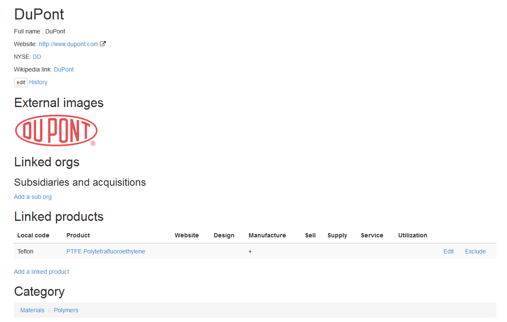

Organization
============

Organization is some kind of factory, plant, corporation or some other type of industrial, engineering or trading organization, which creates :doc:`production</product>`.

Here is an example with `NaiveShark organization profile <http://www.naiveshark.com/org/org/1/>`_ on site.

Linked orgs
-----------
For each organization you can define the list of subsidiaries (acquisition) organization - structure of large holding or corporation, for example. For each subsidiary host organization will be shown as Parent. Each organization can contain unlimited list of subsidiaries, and can have a several parents (for complex form of ownership).

Linked products
---------------

List of product, linked with this organization. You can assign the local (manufacturer) code for product for this organization (local trade-name), and url to product page on organization web-site. Also, you can check the Role of organization to this product (Design, Manufacture, Sell, Supply, Service and Utilization flag available).

Example
-------

For example - `DuPont <http://www.naiveshark.com/org/org/17/>`_

Screen-shot taken at 20 jan 2015.

================================================  ==========================================================================================================
Parameter                                         Value
================================================  ==========================================================================================================
Organization full name                            ``DuPont``
Web-site                                          http://www.dupont.com/
NYSE code                                         ``DD`` (auto converted to https://www.nyse.com/quote/XNYS:DD/ link)
Wikipedia :doc:`keyword</wikipedia>`              ``DuPont`` (auto converted to https://en.wikipedia.org/wiki/DuPont link)
External images (taken from :doc:`Wikimedia commons</wikipedia>`)    ``DuPont.svg``
Subsidiaries and acquisitions                     not listed
Linked products                                   ``PTFE Polytetrafluoroethylene`` (DuPont trade-name - ``Teflon``). DuPont marked as manufacturer of this product
================================================  ==========================================================================================================

Each organization should be assigned to :doc:`category</catalog>`.

