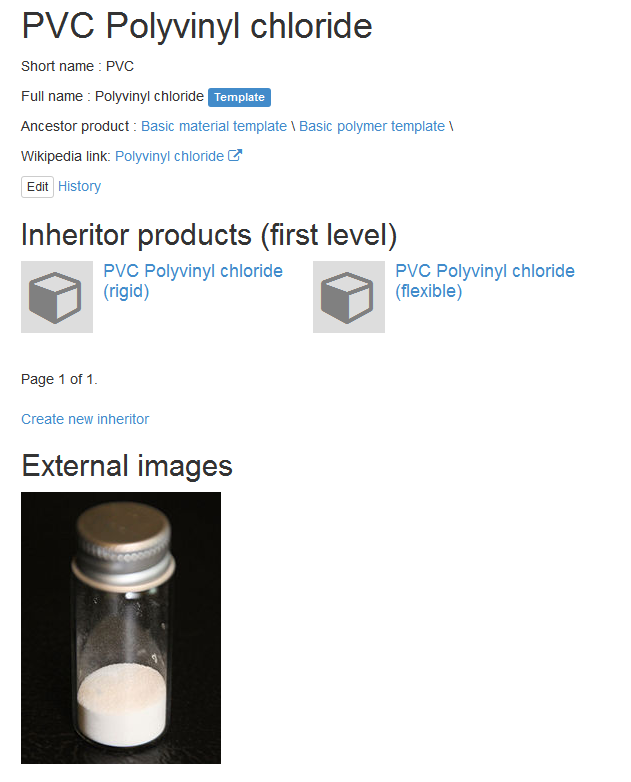

=======
Product
=======

Product is a central part of database. Product mean industrial products, product's family, materials and other types of productions.

Each product can have a list of :doc:`properties</property>`.

Each product should be assigned to :doc:`category</catalog>`.

Product code and name
---------------------

Product short name (code) are optional. Use it for common abbreviation or system identifier of product.

Name is required field and contain full name of product.

Example - look at `PVC <http://www.naiveshark.com/product/product/159/>`_ page. ``PVC`` is a short name, ``Polyvinyl chloride`` - full name.

.. Note::
   Use short name and full name for correct, regular naming and local codes for organization-specific trade-names!   

   
External code
-------------

For each product you can assign the code for linking with external on-line databases. Now available 4 chemical databases (use it for chemical products and substances):

* PubChem
* ChemSpider
* ZINC
* ChEBI

Example from `Unsymmetrical dimethylhydrazine <http://www.naiveshark.com/product/product/178/>`_ page:

=====================  =================  ===============================================================
External database      Example of code    Resulting link (auto generating)
=====================  =================  ===============================================================
PubChem                5976               http://pubchem.ncbi.nlm.nih.gov/summary/summary.cgi?cid=5976
ChemSpider             5756               http://www.chemspider.com/Chemical-Structure.5756.html
ZINC                   no data
ChEBI                  18853              https://www.ebi.ac.uk/chebi/searchId.do?chebiId=18853
=====================  =================  ===============================================================
   
Product templates and inheriting
--------------------------------

Each product can have the list of inherited products. In real world it's mean what:

* 'product1' (child) are designed based on 'product2' (parent) OR
* 'product2' (parent) is a product-family, and 'product1' (child) are product from this family.

Child product inherits the properties from child - and can overwrite it values.

You can mark parent product as 'template'. This mean what it used as basic pattern for ease the data filling of inherited product. Use it for basic (abstract) products or for product family.

Examples from base - PVC
^^^^^^^^^^^^^^^^^^

Screen-shot taken at 20 jan 2015.

`Polyvinyl chloride <http://www.naiveshark.com/product/product/159/>`_ product template have two inherited product:

* `Polyvinyl chloride (rigid) <http://www.naiveshark.com/product/product/160/>`_
* `Polyvinyl chloride (flexible) <http://www.naiveshark.com/product/product/161/>`_

Product properties
------------------

Product measurable and enumerable properties.

Measurable parameters
^^^^^^^^^^^^^^^^^^^^^
* :doc:`Measurable property type</property>`
* Amount (integer, float, fraction, proportion) with optional equality type ( = equal by default, =< great or equal, < great )
* Maximum amount (integer or float)
* Engineering tolerance (integer or float)
* Unit

Amount can be:

======================  ==========  ==========
Numerical type          Example 1   Example 2
======================  ==========  ==========
Integer                 125         -15487000
Float                   154.48      -7e8
Fraction                1/9         -4 3/4
Proportion              1:8         7:9
======================  ==========  ==========

Enumerable parameters
^^^^^^^^^^^^^^^^^^^^^

* :doc:`Enumerable property type</property>`
* Value

BOM
---

Bill of materials for this product.

* Position (optional)
* Subpoduct
* Amount
* Unit (optional)

Related
-------
Each product can have a related - as accessory, repair part etc.

Linked orgs
-----------

List of organizations, linked with product - manufacturers, sellers etc. Described in :doc:`Organization linked product</organization>` page.
