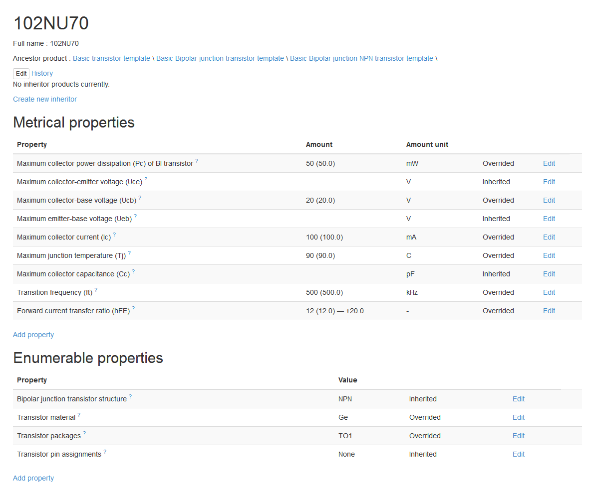

=======
Product
=======

Product is a central part of database. Product mean industrial products, product's family, materials and other types of productions.

Each product can have a list of :doc:`properties</property>`.

Each product should be assigned to :doc:`category</catalog>`.

Product code and name
---------------------

Product short name (code) are optional. Use it for common abbreviation or system identifier of product.

Name is required field and contain full name of product.

Example - look at `PVC <http://www.naiveshark.com/product/product/159/>`_ page. ``PVC`` is a short name, ``Polyvinyl chloride`` - full name.

.. Note::
   Use short name and full name for correct, regular naming. For organization-specific trade-name (or manufacturer code) use the ``local code`` field in ``linked org``'s list! See more :doc:`Organization linked product</organization>`.
   
External code
-------------

For each product you can assign the code for linking with external on-line databases. Now available 4 chemical databases (use it for chemical products and substances):

* PubChem
* ChemSpider
* ZINC
* ChEBI

Example from `Unsymmetrical dimethylhydrazine <http://www.naiveshark.com/product/product/178/>`_ page:

=====================  =================  ===============================================================
External database      Example of code    Resulting link (auto generating)
=====================  =================  ===============================================================
PubChem                5976               http://pubchem.ncbi.nlm.nih.gov/summary/summary.cgi?cid=5976
ChemSpider             5756               http://www.chemspider.com/Chemical-Structure.5756.html
ZINC                   no data
ChEBI                  18853              https://www.ebi.ac.uk/chebi/searchId.do?chebiId=18853
=====================  =================  ===============================================================
   
Product templates and inheriting
--------------------------------

Each product can have the list of inherited products. In real world it's mean what:

* 'product1' (child) are designed based on 'product2' (parent) OR
* 'product2' (parent) is a product-family, and 'product1' (child) are product from this family.

Child product inherits the properties from child - and can overwrite it values.

.. Note::
   Do not confuse inheriting and BOM! *Inherit* - mean *designed based on*. *BOM* mean *included to assembly*!

You can mark parent product as 'template'. This mean what it used as basic pattern for ease the data filling of inherited product. Use it for basic (abstract) products or for product family.

.. Tip::
   Look at `Most used templates <http://www.naiveshark.com/data_extraction/most_used_templates/>`_ page on site.
   
Examples from base - PVC
^^^^^^^^^^^^^^^^^^^^^^^^

Screen-shot taken at 20 jan 2015.

`Polyvinyl chloride <http://www.naiveshark.com/product/product/159/>`_ product template have two inherited product:

* `Polyvinyl chloride (rigid) <http://www.naiveshark.com/product/product/160/>`_
* `Polyvinyl chloride (flexible) <http://www.naiveshark.com/product/product/161/>`_

Some properties (melting point, for example) of rigid and flexible PVC are equal to base PVC, and some properties (density, for example) - are not equal.

Examples from base - A320neo
^^^^^^^^^^^^^^^^^^^^^^^^^^^^

`A320neo <http://www.naiveshark.com/product/product/45/>`_ product have two editions:

* `A320neo with Pratt & Whitney turbofan engine <http://www.naiveshark.com/product/product/46/>`_
* `A320neo with CMF turbofan engine <http://www.naiveshark.com/product/product/47/>`_

In real world A320neo is a family, and each airline species should be with PW or CMF engine, which mean different BOM and technical specification for each of them.

Examples from base - Basic material template
^^^^^^^^^^^^^^^^^^^^^^^^^^^^^^^^^^^^^^^^^^^^

Some templates hierarchy could be very complex - see `Basic material template <http://www.naiveshark.com/product/product/48/>`_ for example. Such abstract template can't contain precise values - only list of common properties.

Product properties
------------------

Each product can have a list of measurable and enumerable properties. Property value can be own by itself or inherited from parent product.

* :ref:`measurable_parameter_in_prod`
* :ref:`enumerable_parameter_in_prod`

For overview - see the screen-shot of example `102NU70 Bipolar transistor <http://www.naiveshark.com/product/product/6947/>`_.

Screen-shot taken at 20 jan 2015.

* Inherited - value are equal to same value in parent product
* Overrided - property inherited from parent, but value are different
* Own - property doesn't inherited

.. _measurable_parameter_in_prod:

Measurable parameters
^^^^^^^^^^^^^^^^^^^^^
* :doc:`Measurable property type</property>`
* Amount equality type ( ``=`` by default, ``<=`` or ``<`` )
* Amount (integer, float, fraction, proportion) with optional equality type ( = equal by default, =< great or equal, < great )
* Maximum amount (integer or float)
* Engineering tolerance (integer or float)
* Unit
* Measurement condition ( :ref:`measurement_conditions_in_properties`)

Amount can be:

======================  ==========  ==========
Numerical type          Example 1   Example 2
======================  ==========  ==========
Integer                 125         -15487000
Float                   154.48      -7e8
Fraction                1/9         -4 3/4
Proportion              1:8         7:9
======================  ==========  ==========

.. _enumerable_parameter_in_prod:

Enumerable parameters
^^^^^^^^^^^^^^^^^^^^^

* :doc:`Enumerable property type</property>`
* Value

BOM
---

Bill of materials for this product.

* Position (optional)
* Subpoduct
* Amount
* Unit (optional)

Related
-------
Each product can have a related - as accessory, repair part etc.

Linked orgs
-----------

List of organizations, linked with product - manufacturers, sellers etc. Described in :doc:`Organization linked product</organization>` page.
