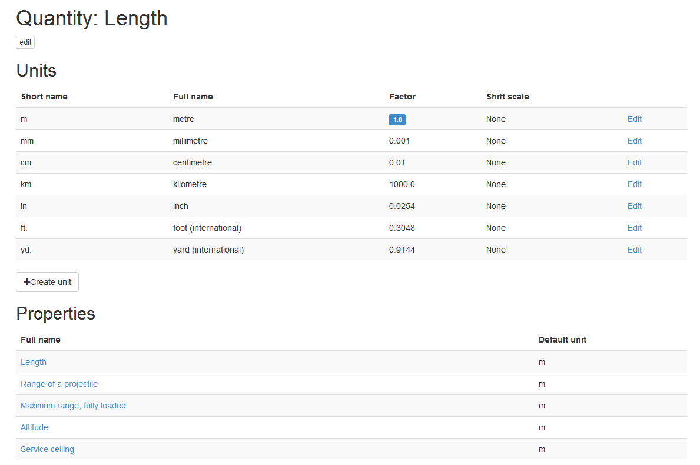

========
Property
========

Property is a portion of information about some :doc:`product</product>`. For example, turbofan engine has 'fan diameter', 'static thrust' and 'bypass ratio' (and many more) properties. All structured properties can be one of two kinds:

* Measurable property

* Enumerable property

Measurable property
-------------------

Each measurable property are derived from physical Quantity. For example, basic physical quantity ``Length`` are used for several product properties - ``Width``, ``Range of a projectile``, ``Maximum range``, ``Typical measuring range`` etc. Each quantity have a list of units - for ``Length`` it's a ``metre``, ``inch``, ``yard`` etc. All units in one Quantity can be easily converted to each one. 

Here is an example `Quantity: Length <http://www.naiveshark.com/property/quantity/2/>`_ on site.

Screen-shot taken at 30 jan 2015.

Unit ``m (metre)`` marked as base with ``Factor = 1``. This mean what all units for this quantity are based from metre - for example, ``kilometre`` has a ``Factor = 1000`` (one thousand metres).

Users can extend list of quantities, units and properties.

.. image:: img/site/property/Length_property.png
Screen-shot taken at 30 jan 2015.

Velocity

http://www.naiveshark.com/property/quantity/8/

Enumerable property
-------------------

Enumerable property is a parameter with list of predefined values. For example, 'IP' (Ingress Protection Rating) can be 'IP22', 'IP67' etc.

Here is an example `Enumerable property: IP <http://www.naiveshark.com/property/enum/2/>`_ on site.

Users can extend list of enumerable properties and values.