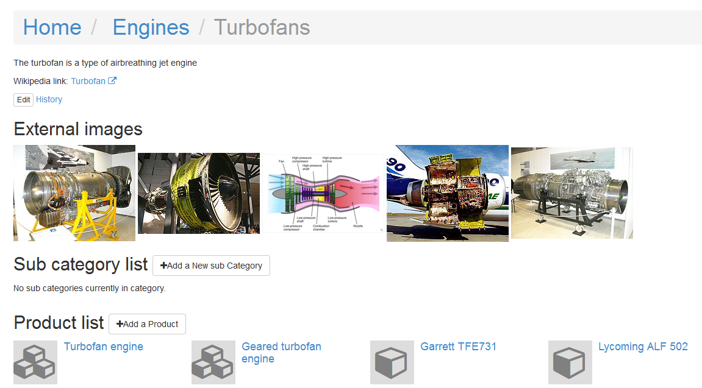

===============
Wikipedia usage
===============

For each :doc:`category</catalog>`, :doc:`product</product>` and :doc:`organization</organization>` you can easily provide the Wikipedia keyword and list of Wikimedia commons images.

Example - Turbofans category
------------

`Turbofans <http://www.naiveshark.com/product/category/7/>`_ category is an example.

View category

Screen-shot taken at 21 jan 2015.

Edit category

Screen-shot taken at 21 jan 2015.

`Wiki keyword` (`Turbofan`) is a English Wikipedia article name. Full link (`https://en.wikipedia.org/wiki/Turbofan`) generated automatically.

`Wikimedia img list` is a list of images you can found at `Wikimedia Commons <https://commons.wikimedia.org/>`_.

``Turbofan operation (lbp).png
Ge cf6 turbofan.jpg
Turbo-Union RB199 turbofan engine.jpg
Klimov RD-33 turbofan engine.JPG
Air-ftd-md90-02-ar-8.jpg``

Images are hosted at Wikimedia Commons, and reuses under `Commons:Reusing content outside Wikimedia <https://commons.wikimedia.org/wiki/Commons:Reusing_content_outside_Wikimedia>`_ rule.

To take the image name from Wikimedia Commons you need

* Find wanted image on Wikimedia (for example, `https://commons.wikimedia.org/wiki/File:Port_talbot_large.jpg`_)
* Select the file name and copy to clipboard (after word `File:` as pictured)
* Insert file name to `Wikimedia img list`. Each file name in separated line.

.. image:: img/site/wiki/File_Port_talbot_large_WikimediaCommons.png